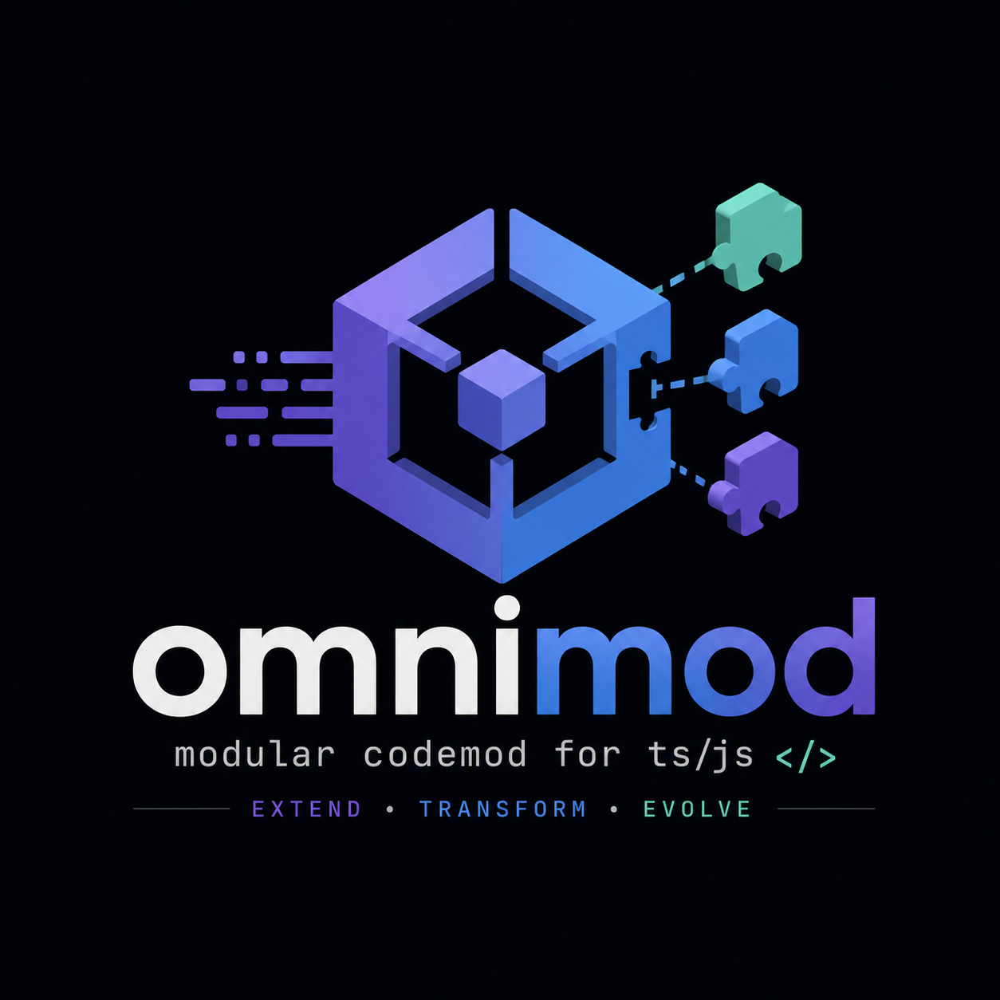

<p align="center">
  
</p>

# omnimod

[](https://github.com/Salnika/omnimod/actions/workflows/ci.yml)
[](https://www.npmjs.com/package/@omnimod/cli)
[](LICENSE)
[](https://salnika.github.io/omnimod/)

A modular, plugin-based codemod tool for TypeScript, JavaScript and React
codebases.

omnimod provides a small codemod engine, a CLI, shared plugin utilities, and a
set of migration plugins. Runs are dry by default, print diffs, and only write
files when `--write` is passed.

Built on Vite+ with `oxc-parser` for parsing, `magic-string` for
formatting-preserving edits, and Vitest/Oxlint/Oxfmt for validation.

Documentation: <https://salnika.github.io/omnimod/>

## Packages

| Package                                          | Description                                 |
| ------------------------------------------------ | ------------------------------------------- |
| [`@omnimod/core`](packages/core)                 | Core codemod engine and plugin contract.    |
| [`@omnimod/plugin-utils`](packages/plugin-utils) | Helpers for authoring omnimod plugins.      |
| [`@omnimod/cli`](packages/cli)                   | The `omnimod` command-line runner.          |
| [`@omnimod/plugin-*`](packages)                  | Built-in migration plugins used by the CLI. |

## Plugins

| Plugin                                                                   | Description                                                         |
| ------------------------------------------------------------------------ | ------------------------------------------------------------------- |
| [`styled-to-vanilla-extract`](packages/plugin-styled-to-vanilla-extract) | Converts supported `styled-components` patterns to vanilla-extract. |
| [`moment-to-dayjs`](packages/plugin-moment-to-dayjs)                     | Migrates Moment.js imports and call sites to Day.js.                |
| [`jest-to-vitest`](packages/plugin-jest-to-vitest)                       | Migrates common Jest APIs and imports to Vitest.                    |
| [`lodash-to-es-toolkit`](packages/plugin-lodash-to-es-toolkit)           | Migrates lodash imports to es-toolkit or native APIs.               |
| [`redux-to-toolkit`](packages/plugin-redux-to-toolkit)                   | Migrates legacy Redux store setup to Redux Toolkit.                 |
| [`react-class-to-hooks`](packages/plugin-react-class-to-hooks)           | Converts simple React class components to hooks.                    |
| [`webpack-to-vite`](packages/plugin-webpack-to-vite)                     | Scaffolds a Vite config from a Webpack config.                      |

Each plugin has its own package README with usage notes. Full guides live in
the documentation site.

## Usage

```bash
# List bundled plugins
omnimod list

# Dry-run: print a diff, write nothing
omnimod run styled-to-vanilla-extract "src/**/*.tsx"

# Apply changes
omnimod run styled-to-vanilla-extract "src/**/*.tsx" --write
```

On `--write`, omnimod formats changed files with the target project's own
formatter or linter when one can be detected. Pass `--no-format` to skip that
step.

## Development

```bash
vp install
vp run -r build
vp check
vp run knip
vp run -r test
```

Docs are a standalone VitePress site:

```bash
npm --prefix docs install
npm --prefix docs run dev
```

## Releases

Package versioning uses Changesets plus the repository release planner:

```bash
pnpm changeset
pnpm run version:plan
pnpm run version:apply
pnpm install --lockfile-only
git tag v0.1.1
git push origin master v0.1.1
```
